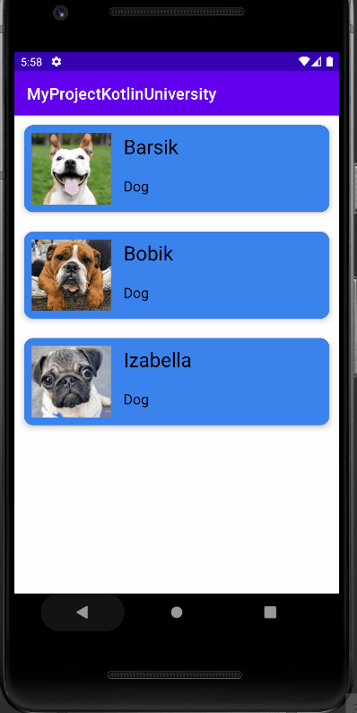

# MyProjectKotlinUniversity

## Description
MyProjectKotlinUniversity is a Kotlin-based Android application that demonstrates fetching data from the internet in JSON format and displaying it on the screen. It includes at least two screens implemented using fragments, each with its own ViewModel. The app utilizes Retrofit library for internet requests and Navigation library for fragment navigation. It follows a clean architecture pattern.

## Features
- Fetches data from the internet in JSON format.
- Displays fetched data on the screen.
- Implements at least two screens using fragments.
- Utilizes ViewModel for each fragment.
- Uses Retrofit library for internet requests.
- Implements navigation between fragments using Navigation library.

## Prerequisites
- Android Studio with Kotlin support.

## Installation
1. Clone the repository.
2. Open the project in Android Studio.
3. Build the project.
4. Run the application on an emulator or physical device.

## Usage
- Upon launching the app, the user is presented with a list of animals on the first screen.
- Clicking on an animal opens the second screen displaying detailed information about the selected animal.
- The app fetches random facts about the selected animal from the internet and displays them on the second screen.
- The app also fetches a random image of the selected animal from the internet and displays it on the second screen.

   

## Libraries Used
- Retrofit: For making HTTP requests to fetch data from the internet.
- Gson: For converting JSON response to Kotlin objects.
- Glide: For loading and displaying images from URLs.
- Navigation: For implementing navigation between fragments.
- ViewModel: For managing UI-related data in a lifecycle-conscious way.

## Contributing
Contributions are welcome! Feel free to open issues or pull requests for any improvements or fixes.

## License
This project is licensed under the MIT License.

Developed by Maksym Chalyi 2023
